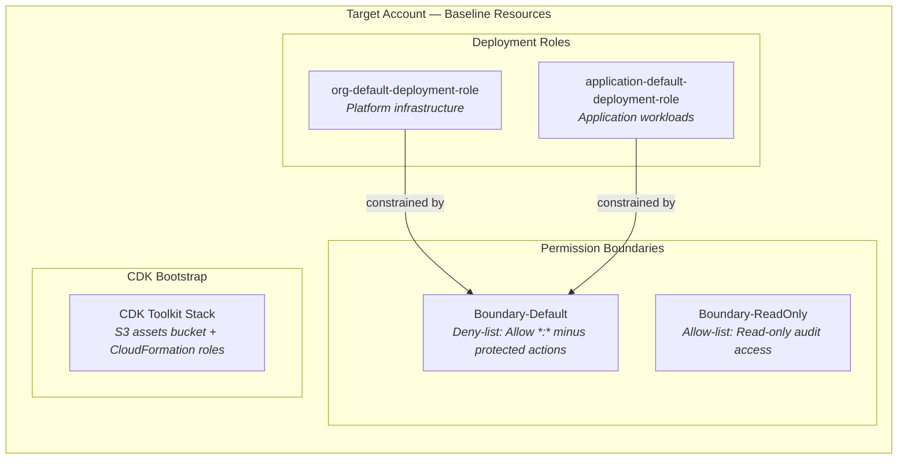
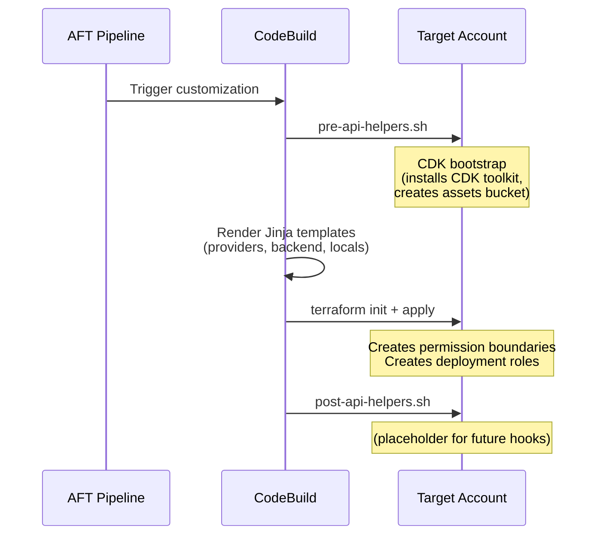
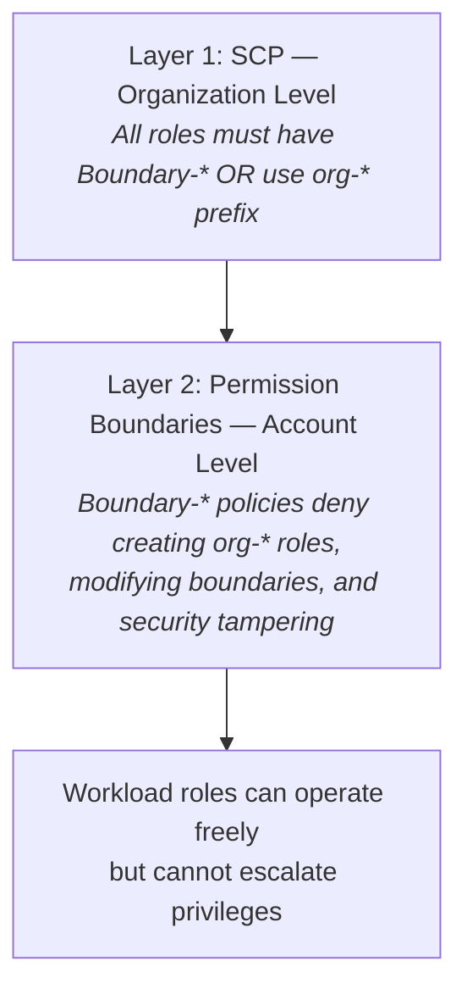

# Baseline Customization

**Applied to**: Every vended AWS account
**Managed by**: AFT (Account Factory for Terraform)
**Last Updated**: February 13, 2026

## Purpose

The baseline customization establishes IAM security governance in every account vended through AWS Control Tower. It deploys permission boundaries to prevent privilege escalation and cross-account deployment roles for automated infrastructure provisioning.

## What Gets Deployed



| Resource | Type | Purpose |
|----------|------|---------|
| `Boundary-Default` | IAM Policy | Allows all services, denies privilege escalation and security service tampering |
| `Boundary-ReadOnly` | IAM Policy | Restricts to read-only actions for audit/compliance roles |
| `org-default-deployment-role` | IAM Role | Platform deployments from automation account |
| `application-default-deployment-role` | IAM Role | Application deployments from automation account |
| CDK Toolkit Stack | CloudFormation Stack | Enables AWS CDK deployments in the account |

## Execution Flow



## Security Model

Two layers work together to prevent privilege escalation:



## File Structure

```
baseline/
├── terraform/
│   ├── iam-permission-boundaries.tf   # Dynamic boundary creation (for_each)
│   ├── iam-deployment-roles.tf        # Platform + application roles
│   ├── boundary-policies/
│   │   ├── Default.json               # Deny-list boundary template
│   │   └── ReadOnly.json              # Allow-list boundary template
│   ├── variables.tf                   # protected_role_prefix, boundary_policy_prefix
│   ├── locals.tf                      # Common tags
│   ├── outputs.tf                     # Role ARNs, boundary ARNs
│   ├── data.tf                        # Account ID, region
│   ├── aft-providers.jinja            # Provider config (rendered by AFT)
│   ├── backend.jinja                  # Backend config (rendered by AFT)
│   └── locals-aft.tf.jinja            # AFT account ID extraction
├── api_helpers/
│   ├── pre-api-helpers.sh             # Runs CDK bootstrap before Terraform
│   ├── post-api-helpers.sh            # Placeholder for post-deploy hooks
│   └── shell_scripts/
│       └── cdk-bootstrap.sh           # CDK bootstrap with AFT trust
└── docs/
    ├── BASELINE.md                    # This file
    ├── DEPLOYMENT_ROLES.md            # Roles and boundaries reference
    ├── iam-permission-boundaries.md   # Boundary design deep-dive
    ├── iam-deployment-roles.md        # Role design deep-dive
    ├── variable-naming-convention.md  # Prefix vs pattern naming
    ├── _tldr-doc.md                   # Quick reference
    └── external-references/           # Docs from other projects
```

## Key Design Patterns

**Dynamic policy discovery** — Drop a `.json` file in `boundary-policies/` and Terraform auto-discovers it via `fileset()`. The IAM policy name is `Boundary-<filename>`. No HCL changes needed.

**Template variable injection** — Boundary policies use `${account_id}`, `${protected_role_prefix}`, `${boundary_policy_prefix}`, and `${boundary_name}` which are rendered by `templatefile()` at plan time.

**Dual trust patterns** — Deployment roles accept both broker role chaining (`org-automation-broker-role`) and direct CodeBuild assumption (`CodeBuild-*-ServiceRole`), secured by `aws:PrincipalOrgID` + `aws:PrincipalArn` conditions.

## Configuration

| Variable | Default | Purpose |
|----------|---------|---------|
| `protected_role_prefix` | `org` | Prefix for protected roles (produces `org-*` pattern in policies) |
| `boundary_policy_prefix` | `Boundary` | Prefix for boundary policy names (produces `Boundary-Default`, etc.) |

## Detailed Documentation

- [DEPLOYMENT_ROLES.md](DEPLOYMENT_ROLES.md) — Deployment roles and permission boundaries reference
- [iam-permission-boundaries.md](iam-permission-boundaries.md) — Boundary design, user guide, developer guide
- [iam-deployment-roles.md](iam-deployment-roles.md) — Role architecture, trust policies, usage examples
- [variable-naming-convention.md](variable-naming-convention.md) — Why prefixes and patterns are separate
- [_tldr-doc.md](_tldr-doc.md) — Quick reference card
