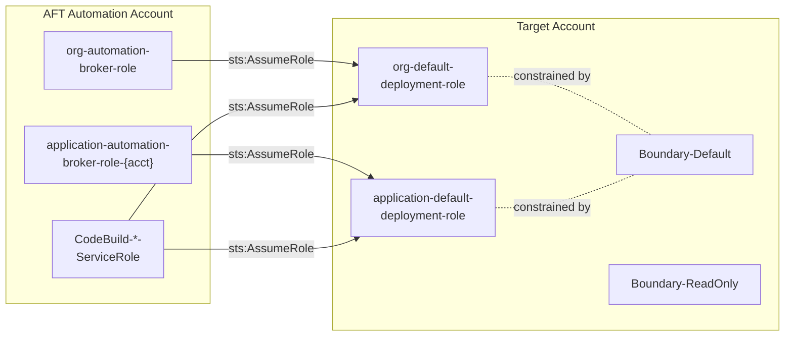
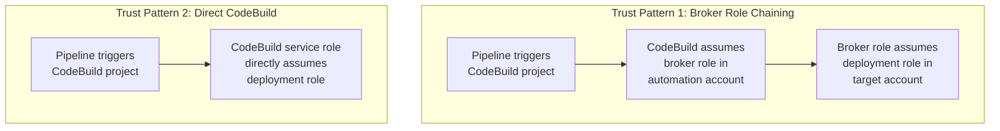
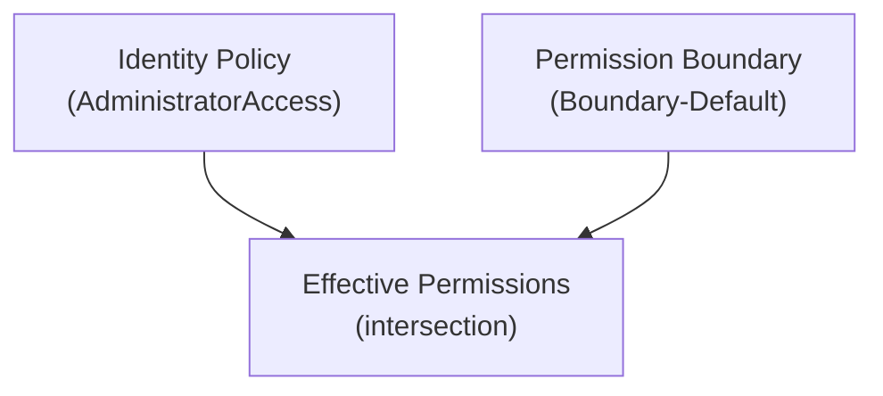
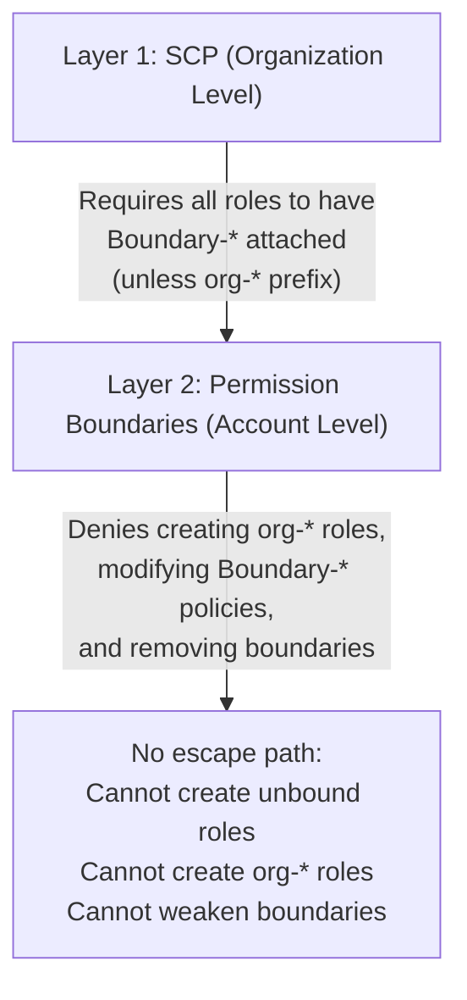
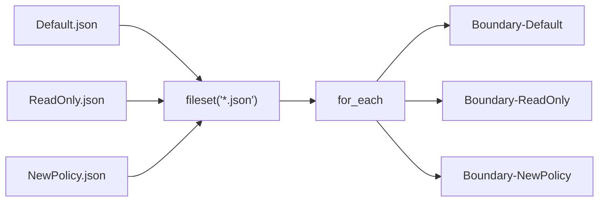

# Deployment Roles & Permission Boundaries

**Applied to**: Every vended AWS account
**Source**: `baseline/terraform/iam-deployment-roles.tf`, `baseline/terraform/iam-permission-boundaries.tf`
**Last Updated**: February 13, 2026

## Overview

The baseline deploys two cross-account IAM roles and two permission boundary policies into each vended account. The roles allow the AFT automation account to deploy infrastructure remotely. The permission boundaries constrain what those roles (and any roles they create) can do.



---

## Deployment Roles

### org-default-deployment-role

| Property | Value |
|----------|-------|
| **Name** | `org-default-deployment-role` |
| **Path** | `/org/` |
| **Permissions** | `AdministratorAccess` (AWS managed policy) |
| **Boundary** | `Boundary-Default` |
| **Session Duration** | 12 hours (43200 seconds) |
| **Purpose** | Platform infrastructure deployments |

### application-default-deployment-role

| Property | Value |
|----------|-------|
| **Name** | `application-default-deployment-role` |
| **Path** | `/org/` |
| **Permissions** | `AdministratorAccess` (AWS managed policy) |
| **Boundary** | `Boundary-Default` |
| **Session Duration** | 12 hours (43200 seconds) |
| **Purpose** | Application workload deployments |

### Key Differences

Both roles have identical permissions and boundaries. They differ in **trust policy scope**:

| | org-default-deployment-role | application-default-deployment-role |
|---|---|---|
| **Broker role** | `org-automation-broker-role` | `application-automation-broker-role-{account-id}` |
| **Broker match** | `StringEquals` (exact) | `StringEquals` (exact, includes target account ID) |
| **CodeBuild match** | `StringLike` (wildcard) | `StringLike` (wildcard) |
| **Intended for** | Org-wide platform tooling | Per-account application workloads |

---

## Trust Policy Architecture

Each deployment role accepts two trust patterns. Both require the caller to be in the same AWS Organization.



### Trust Conditions

Every trust statement enforces two conditions:

1. **`aws:PrincipalOrgID`** — Caller must belong to the same AWS Organization (`StringEquals`)
2. **`aws:PrincipalArn`** — Caller must match a specific role pattern

| Statement | Condition | Pattern |
|-----------|-----------|---------|
| `TrustBrokerRole` | `StringEquals` on `PrincipalArn` | `arn:aws:iam::{automation}:role/org/org-automation-broker-role` |
| `TrustCodeBuildServiceRoles` | `StringLike` on `PrincipalArn` | `arn:aws:iam::{automation}:role/CodeBuild-*-ServiceRole` |

The automation account ID is retrieved at deploy time from the AFT SSM parameter `/aft/account/aft-management/account-id`.

---

## Permission Boundaries

### How Boundaries Work

A permission boundary sets the **maximum permissions** a role can have. The effective permissions are the **intersection** of:



Even with `AdministratorAccess`, the deployment roles cannot perform any action denied by `Boundary-Default`.

### Boundary-Default (Deny-by-Exception)

**Design**: Allow everything, then explicitly deny dangerous actions.

| Statement | What It Denies |
|-----------|---------------|
| `AllowAllServices` | *(Allow `*:*` — baseline for intersection)* |
| `DenyCreateProtectedRoles` | Creating roles with `org-*` prefix |
| `DenyModifyProtectedRoles` | Updating, deleting, or retagging `org-*` roles |
| `DenyCreatePermissionBoundaryPolicies` | Creating policies with `Boundary-*` prefix |
| `DenyModifyAnyBoundaryPolicy` | Versioning or deleting `Boundary-*` policies |
| `DenyRemovingBoundaries` | Removing permission boundaries from any role |
| `RequireBoundaryOnRoleCreation` | Creating roles without a `Boundary-*` boundary attached |
| `DenyBillingChanges` | Modifying billing, payment methods |
| `DenyMarketplaceSubscriptions` | Subscribing/unsubscribing from Marketplace |
| `DenyIdentityCenterChanges` | Any SSO, SSO Directory, or Identity Store action |
| `DenyCloudTrailChanges` | Deleting/stopping/modifying CloudTrail |
| `DenyConfigChanges` | Deleting/stopping AWS Config recorders and channels |
| `DenySecurityServiceChanges` | Disabling GuardDuty, Security Hub, or IAM Access Analyzer |
| `ProtectInfrastructureLogs` | Deleting AFT-related log groups or `org-*` log groups |

### Boundary-ReadOnly (Allow-List)

**Design**: Explicitly allow only read operations. No baseline Allow `*:*`.

| Category | Allowed Actions |
|----------|----------------|
| IAM Access Analyzer | `Get*`, `List*` |
| CloudTrail | `Get*`, `List*`, `Lookup*`, `Describe*` |
| CloudWatch | `Describe*`, `Get*`, `List*` |
| AWS Config | `Describe*`, `Get*`, `List*`, `Select*` |
| EC2 | `Describe*` |
| IAM | `Get*`, `List*`, `Generate*` |
| GuardDuty | `Get*`, `List*` |
| Security Hub | `Describe*`, `Get*`, `List*` |
| S3 | `List*`, `Get*Acl`, `Get*Policy`, `Get*Configuration`, `GetBucket*`, `GetEncryption*`, `GetLifecycle*`, `GetReplication*` |
| CloudWatch Logs | `Describe*`, `Get*`, `List*`, `FilterLogEvents` |
| KMS | `Describe*`, `Get*`, `List*` |
| Organizations | `Describe*`, `List*` |

**Additional Denies**: S3 object data access (`GetObject*`, `PutObject*`) and secrets access (`secretsmanager:GetSecretValue`, `ssm:GetParameter*`).

---

## Security Model

The two-layer defense prevents privilege escalation even when roles have `AdministratorAccess`:



### Escalation Paths Blocked

| Attack Vector | Blocked By |
|---------------|------------|
| Create an unbound role | SCP requires `Boundary-*` on all non-`org-*` roles |
| Create an `org-*` role to bypass boundaries | `DenyCreateProtectedRoles` in boundary |
| Modify an existing `org-*` role | `DenyModifyProtectedRoles` in boundary |
| Remove a boundary from a role | `DenyRemovingBoundaries` in boundary |
| Modify a boundary policy to weaken it | `DenyModifyAnyBoundaryPolicy` in boundary |
| Create a new boundary without protections | `DenyCreatePermissionBoundaryPolicies` in boundary |
| Disable security monitoring | `DenySecurityServiceChanges`, `DenyCloudTrailChanges`, `DenyConfigChanges` |

---

## Dynamic Policy Discovery

Boundary policies are auto-discovered from JSON files in `boundary-policies/`:



**To add a new boundary**: Drop a `.json` file in `baseline/terraform/boundary-policies/`. The `Boundary-` prefix is added automatically by Terraform. No HCL changes needed.

### Template Variables

All boundary policy JSON files are processed through `templatefile()` with these variables:

| Variable | Source | Example Value |
|----------|--------|---------------|
| `${account_id}` | `data.aws_caller_identity.current.account_id` | `914089393341` |
| `${protected_role_prefix}` | `var.protected_role_prefix` | `org` |
| `${boundary_policy_prefix}` | `var.boundary_policy_prefix` | `Boundary` |
| `${boundary_name}` | `each.key` (filename without `.json`) | `Default` |

---

## Usage Examples

### Assuming a Deployment Role

```bash
# Platform deployments (from automation account)
aws sts assume-role \
  --role-arn "arn:aws:iam::TARGET_ACCOUNT:role/org/org-default-deployment-role" \
  --role-session-name "platform-deploy"

# Application deployments (from automation account)
aws sts assume-role \
  --role-arn "arn:aws:iam::TARGET_ACCOUNT:role/org/application-default-deployment-role" \
  --role-session-name "app-deploy"
```

### What Deployment Roles Can Do

- Deploy AWS services (EC2, Lambda, S3, RDS, etc.)
- Create IAM roles (must attach a `Boundary-*` policy)
- Create IAM policies (except `Boundary-*` prefix)
- Manage infrastructure as code

### What Deployment Roles Cannot Do

- Create or modify `org-*` prefixed roles
- Create or modify `Boundary-*` policies
- Remove permission boundaries from any role
- Modify billing, SSO, CloudTrail, Config, GuardDuty, Security Hub
- Delete AFT-related log groups

---

## Terraform Resources

| Resource | Type | File |
|----------|------|------|
| `aws_iam_role.org_default_deployment` | IAM Role | `iam-deployment-roles.tf` |
| `aws_iam_role.application_default_deployment` | IAM Role | `iam-deployment-roles.tf` |
| `aws_iam_role_policy_attachment.org_default_deployment_admin` | Policy Attachment | `iam-deployment-roles.tf` |
| `aws_iam_role_policy_attachment.application_default_deployment_admin` | Policy Attachment | `iam-deployment-roles.tf` |
| `aws_iam_policy.boundaries["Default"]` | IAM Policy | `iam-permission-boundaries.tf` |
| `aws_iam_policy.boundaries["ReadOnly"]` | IAM Policy | `iam-permission-boundaries.tf` |
| `data.aws_organizations_organization.current` | Data Source | `iam-deployment-roles.tf` |
| `data.aws_caller_identity.current` | Data Source | `data.tf` |

---

## Outputs

| Output | Description |
|--------|-------------|
| `org_deployment_role_arn` | ARN of the platform deployment role |
| `org_deployment_role_name` | Name of the platform deployment role |
| `application_deployment_role_arn` | ARN of the application deployment role |
| `application_deployment_role_name` | Name of the application deployment role |
| `boundary_policy_arns` | Map of boundary names to ARNs |
| `boundary_policy_names` | List of all boundary policy names |
| `boundary_policy_ids` | Map of boundary names to IDs |
| `automation_account_id` | AFT automation account ID from SSM |
| `organization_id` | AWS Organization ID |

---

## Troubleshooting

| Problem | Likely Cause | Resolution |
|---------|-------------|------------|
| `AccessDenied` on `sts:AssumeRole` | Organization ID mismatch or wrong broker role | Verify `aws:PrincipalOrgID` and `aws:PrincipalArn` values |
| Role creation denied | Missing permission boundary on new role | Attach a `Boundary-*` policy before creating the role |
| Cannot modify `org-*` role | `DenyModifyProtectedRoles` in boundary | These roles are managed by AFT only |
| `Boundary-*` policy creation denied | `DenyCreatePermissionBoundaryPolicies` in boundary | New boundaries must be deployed through AFT baseline |
| SSM parameter not found | Running outside AFT context or AFT not deployed | Ensure `/aft/account/aft-management/account-id` exists |
| Session expired | 12-hour maximum session duration | Re-authenticate via `sts:AssumeRole` |
